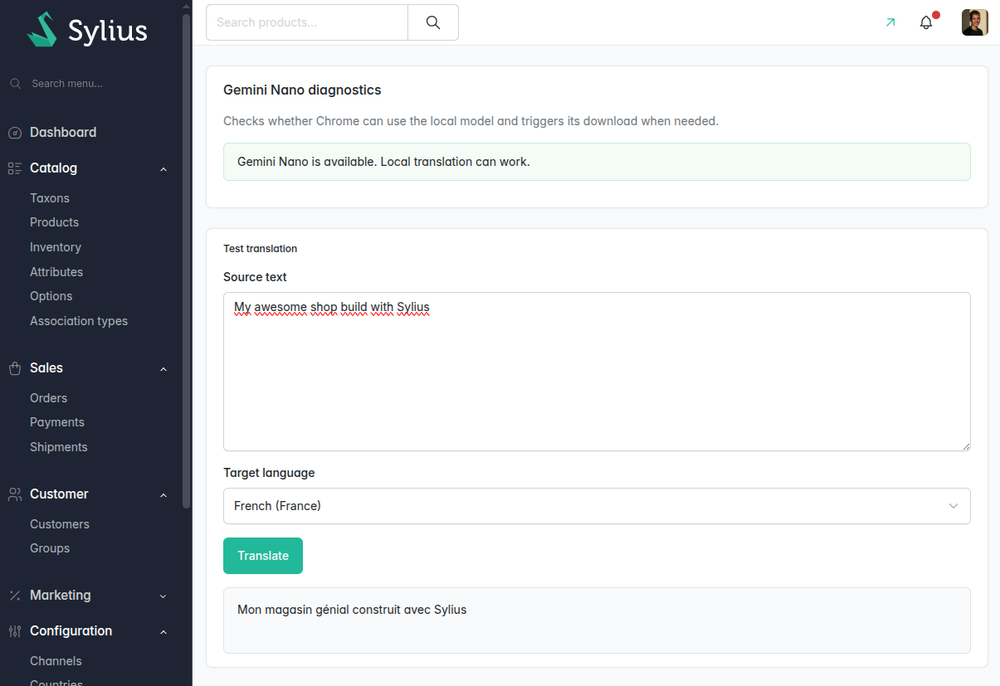
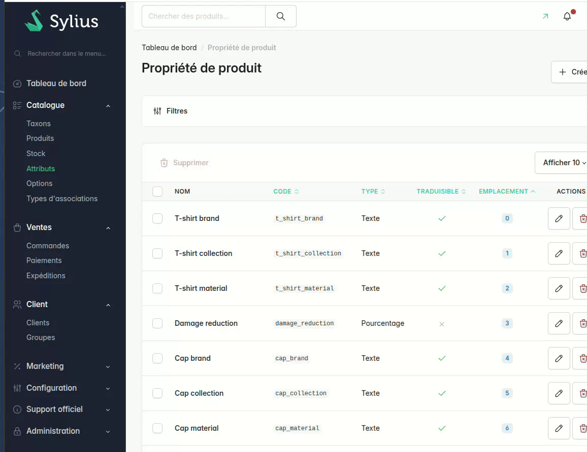

# SyliusGeminiLocalTranslatePlugin

This plugin adds a translation button to every translatable field in the Sylius admin. It uses Chrome's built-in Gemini Nano model via the Prompt API — all inference runs on-device, no data ever leaves the browser.



## Requirements

- Chrome 127+ (stable channel) with **Prompt API for Gemini Nano** enabled [(chrome://flags/#prompt-api-for-gemini-nano)](chrome://flags/#prompt-api-for-gemini-nano)
- The Gemini Nano model must be downloaded (check chrome://components)

## Installation

```console
$ composer require barth/sylius-gemini-local-translate-plugin
$ yarn install --force
$ yarn build
```

### Symfony configuration

The bundle registers itself automatically via Symfony Flex. Manual registration:

```php
// config/bundles.php
return [
    Barth\SyliusGeminiLocalTranslatePlugin\BarthSyliusGeminiLocalTranslatePlugin::class => ['all' => true],
];
```

### Routes registration

```yaml
# config/routes.yaml
barth_gemini_local_translate_plugin:
    resource: "@BarthSyliusGeminiLocalTranslatePlugin/config/routes/admin_routing.yaml"
```

## Usage

1. Go to any Sylius admin translatable field.
2. Select the target language and register (tone).
3. Click **Translate** — the field content is sent to Chrome's local Gemini Nano model.
4. The translated result replaces the field value.

No data leaves the browser. All inference runs on-device.

> [!CAUTION]
> ⚠️ AI translation can contain errors. Do not rely blindly on the output; always review and verify the generated translations for accuracy and appropriate tone before saving.


## Diagnostics

Visit `/admin/gemini-local-translate-plugin/diagnostic` in your admin to verify that the Chrome Prompt API is available.

## Add it to custom translation field

If you added translated fields and the button does not appear, you may add a hook to your form:

```yaml
sylius_twig_hooks:
  hooks:
    'sylius_admin.my_awesome_entity.create.content.sections.form.translations': 
      gemini_translate_button:
        template: '@BarthSyliusGeminiLocalTranslatePlugin/admin/form/translations/button.html.twig'
        priority: -10
```

## Credits

This plugin was inspired by the [GromNaN/local-browser-translator](https://github.com/GromNaN/local-browser-translator) repository.

## Demo


